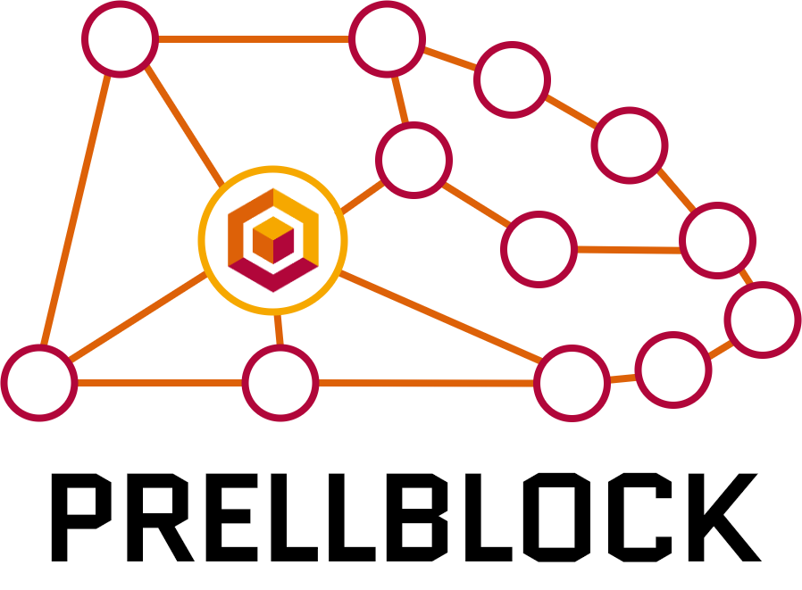
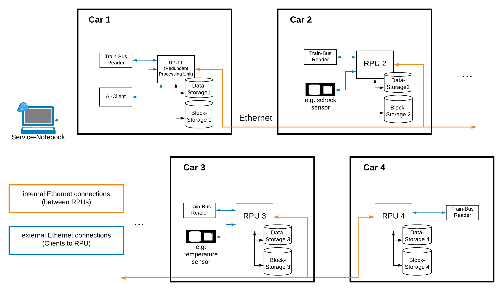

# Prellblock

Bahndaten verlässlich und schnell in die Blockchain gepuffert - **Persistente Redundante Einheit für Langzeit-Logging über Blockchain**



[[_TOC_]]

## Overview

`Prellblock` is a lightweight (private) logging blockchain, written in `Rust`, which is designed for datastorage purposes in a railway environment.
By using an replicate-order-validate-execute procedure it is assured, that data will be saved, even in case of a total failure of all but one redundant processing unit.
While working in full capactiy, data is stored and validated under byzantine fault tolerance. This project is carried out in cooperation with **Deutsche Bahn AG represented by DB Systel GmbH**.

### Network and Architecture

The functionality of the blockchain is split into two basic components: **RPUs** (Redundant Processing Units) and **Clients**.
An *RPU* is a peer in the blockchain and may participate in the consensus process. This is similar to the term *Peer* used in most other blockchains.
A *Client* can send transactions to RPUs.
All components are connected via Ethernet.

A network for using Prellblock could look like this (in a railway environment):


## Setting Up Prellblock

Prellblock provides a setup wizard to generate the genesis transactions.
This is the starting point for the blockchain and has to include at least 4 different RPUs.

**A detailed guide to using the wizard** can be found in the [`genesis-wizard` subdirectory](./genesis-wizard).

After stepping through the wizard, all necessary configuration files should have been created.
An example configuration is provided in the [`config` subdirectory](./config).<br />
*Caution:* The configuration will not work out of the box, because you are missing the private keys and certificates for the RPUs and the Certificate Authority (see [TLS](...))!

<!-- ### RPU Identitiy

Each RPU has to have an identity. They can be generated with the following command:

```sh
cargo run --bin gen-key <rpu_name>
```

The files are placed (and searched in prellblock) in `config/<rpu_name>/`:

- `<rpu_name>.key` is the **private key** of the identity.
- `<rpu_name>.pub` is the **public key** of the identity. -->

### Configuration files

Each RPU needs a *private configuration* (which is also created by the genesis wizard).
In that file, you have to specify paths to various files like the TLS private key.

An example looks like this (`emily.toml`):

```toml
identity = "config/emily/emily.key" # path to the RPU's account's private key 
tls_id = "config/emily/emily.pfx" # path to the TLS private key
block_path = "blocks/emily" # path for the blocks
data_path = "data/emily" # path for storing transactions temporarily
```

## Running Prellblock

### Building Prellblock

All binaries and libraries can be built by installing [Rust and Cargo via Rustup](https://rustup.rs) and running the following commands:

```sh
rustup toolchain install nightly
rustup override set nightly
cargo build --release
```

Because of some dependencies, Prellblock needs to be compiled with the *nightly* toolchain.<br />
*Info:* Running Prellblock in Debug-Mode (without the `--release` flag) will degrade the performance of the RPU.

#### Cross-Compiling for ARM based machines

For running Prellblock on a RaspberryPi or similar ARM-based machines, you need to cross compile the blockchain.
Building fully static binaries can be done via [`cross`](https://github.com/rust-embedded/cross) (this needs Docker to be running):

```sh
rustup toolchain install nightly
rustup override set nightly
cargo install cross
cross build --target armv7-unknown-linux-musleabihf --release
```

### Starting the Blockchain

Running an RPU can be done via the following command:

```sh
cargo run --release --bin prellblock -- config/<rpu-name>/<rpu-name>.toml config/genesis/genesis.yaml
```

The genesis file is only needed for the first run, after that you can provide a path to a configuration file only.
For the structure of a configuration file see [...](...).
You need to start **at least four different RPUs** in order to allow the consensus algorithm to work properly.

### Usage Of TLS

The blockchain by default uses TLS for the connections.
You therefore need certificates for running a prellblock **RPU**.

These certificates are stored in the `*.pfx` file format.
They are used by Prellblock to load the TLS certificate.
Since they are protected by a password, Prellblock needs to know the password for reading the file.<br />
RPU TLS certificates and keys (`config/<rpu_name>/<rpu_name>.pfx`) created by [Fill Collins](./genesis-wizard) will have the default password `prellblock`.
**Warning: Do not use the default password in production!**<br />
You can pass another password to Prellblock via the `TLS_PASSWORD` environment variable. 

Furthermore, each Client and RPU need to know the TLS certificate of the Certificate Authority. By default, Clients and RPUs search in `$PWD/config/ca/ca-certificate.pem`.
To override this value, set the `CA_CERT_PATH` environment variable:

```sh
export CA_CERT_PATH="/path/to/ca-certificate.pem"
```

### Logging

Prellblock includes a lot of useful log output, by default only *warnings and errors* are displayed in the console.
To help setting the correct log-levels, you can use the [`run.sh`](./run.sh) script.
You **need to create** a `run.local.sh` script to configure logging.
Available levels are:

- `trace`
- `debug`
- `info`
- `warn`
- `error`
- `off`

An example `run.local.sh` file would be:

```sh
level info

debug prellblock::
trace prellblock::consensus
error balise
```

This will set the default log level to `info`, show only `error` logs of `balise`, enable `debug` loglevel in submodules of `prellblock` and show all logs (`trace`) of the `consensus` submodule (sets `RUST_LOG=info,prellblock::=debug,prellblock::consensus=trace,balise=error`).
To use this configuration execute `./run.sh <binary> <options>` instead of `cargo run -- bin <binary> -- <options>`.
If you whish to run `cargo watch` you can also run the script with `./run.sh w(atch) <binary> <options>`.

## Using `prellblock-client`

The `prellblock-client` binary provides a CLI with predefined commands for each of the transaction types. Otherwise, you can use the provided library as dependency to build your own clients.

**Info:** As of now, there is no possibility for a Client to track a transaction through the system.
Clients won't be notified of the result whether the transaction is finally included in the blockchain ("fire and forget").

Currently implemented actions are:

- benchmarking (using `bench <turi-address> <key> <number of transactions>` subcommand)
- [creating new accounts](#creating-new-accounts) (using `create_account <turi-address> <peer-id> <name> <permission-file>` subcommand)
- checking the current block number (using `current_block_number <turi-address>` subcommand)
- [deleting accounts](#deleting-accounts) (using `delete_account <turi-address> <peer-id>` subcommand)
- [reading account details](#reading-from-the-blockchain) (using `get_account <turi-address> <peer-ids>...`)
- [reading blocks](#reading-from-the-blockhain) (using `get_block <turi-address> <filter>` subcommand)
- [reading values from the blockchain](#reading-from-the-blockchain) (using `get_value <turi-address> <peer-id> <filter> <span> <end> <skip>` subcommand)
- [setting a key to a specific value](#key-value-transactions) (using `set <turi-address> <key> <value>` subcommand)
- [updating account permissions](#updating-accounts) (using `update <turi-address> <peer-id> <permission-file>` subcommand)

#### Key-Value Transactions

The keys for this type of transaction needs to be of type `string`, whereas values may be of any type.

#### Reading from the blockchain

There are several ways to read values from the blockchain. You can read the current `block number`, information about `accounts`, whole `blocks` or certain `values`.
1. The subcommand `current_block_number` will give you the block number of the next block to be craeted (which is the current length of the blockchain).
2. The subcommand `get_account <turi-address> <peer-ids>` will print information about the specified accounts. You may request information about multiple accounts by including multiple peer ids.
3. The subcommand `get_block <turi-address> <filter>` will display a block's information. Again, you may request information about more blocks. A range of blocks can be specified by giving a range of block number. For valid filters see [Filters](#filters).
4. The subcommand `get_value <turi-address> <peer-id> <filter> <span> <end> <skip>` will get (multiple) logged values of a given account (`peer-id`). Keys to read are selected using `filter`. The `span` specifies how many values (or which timespan) should be read, while `end` specifies the last value to read (a date or x values from last). `skip` can skip x values or a specific timespan between each read value.

##### Filters

Filters can be used in the following ways:

- **".."**: all values
- **"1..100"**: all values from 1 (inclusive) to 100 (exclusive)
- **"42.."**: all values from 42 (inclusive)
- **"..42"**: all values until 42 (exclusive)

This also works with strings using lexicographical order.

#### Account Transactions:

For modifying accounts, the sender account **must be of type Admin**.

##### Updating accounts

The specified `peer-id` needs to be a hex-value ed25519 public key.

```sh
cargo run --bin prellblock-client -- <turi-address> <target account id as hex> <path to permission file>
```

The permission file is a `yaml`-file containing all necessary permission informations to be applied onto the target account.
Reading rights can be specified as white- or blacklist. They refer to one or more accounts. Furthermore you can define white- or blacklists for specific keys that either can be read or must not be read.
For its structure, see the example below (all fields can be ommitted resulting in that field being left unchanged):

```yaml
expire_at: #never
  at_date: 2020-07-01T10:04:59.300878700Z
has_writing_rights: true
reading_rights:
  - whitelist:
      accounts:
        - 256cdb0197402705f96d39eab7dd3d47a39cb75673a58852d83f666973d80e01
      namespace:
        - scope: test
```

**NOTE:** If you change an account's account-type to `RPU`, it will immediately be part of the validating set of nodes and will partake in the consenus until it gets removed.

##### Creating new accounts

Using the `create` subcommand as an Admin-account, you can create new accounts during the runtime of Prellblock.

```sh
cargo run --bin prellblock-client -- create <turi-address> <id of the new account> <name of the new account> <permission-file>
```

For this, you need a ed25519 key-pair, the public key of which serves as the `PeerId` for the new account. Said `PeerId` will be used as the first parameter (after the turi-ipv4-address that is). Next you will need to specifiy a name for the new account. Lastly, you need to specify a path to a permission file, similar to the one explained under [Updating accounts](#updating-accounts).

**NOTE:** If you create an account with the account-type `RPU`, it will immediately be part of the validating set of nodes and will partake in the consenus until it gets removed.

##### Deleting accounts

As an admin account, it is possible to delete accounts from the system using the `delete`-subcommand.

```sh
cargo run --bin prellblock-client -- delete <turi-address> <id of the account to delete>
```

The id of the account to delete needs to be a `PeerId` of an existing account in the system. Upon successful completion of this command, the account with the given `PeerId` will no longer be available for sending transactions or requests, but the data it has written before can still be queried through other accounts.

<!-- ### Profiling

For testing speed and efficiency of the Prellblock, there is a tool called [flamegraph-rs/flamegraph](https://github.com/flamegraph-rs/flamegraph).
You can install it via `cargo install flamegraph`. On Linux (Debian) you need to install `linux-perf`, too.
To generate an interactive graph on **Linux**, run:

```sh
sudo sysctl -w kernel.perf_event_paranoid=1
./run.sh f prellblock <options>
```

On **macOS** run:

```sh
./run.sh f prellblock <options>
```

After stopping the program, a graph (`flamegraph.svg`) will be created. -->

## License

Prellblock is primarily distributed under the terms of both the MIT license and the Apache License (Version 2.0), with portions covered by various BSD-like licenses.

See [LICENSE-APACHE](./LICENSE-APACHE) and [LICENSE-MIT](./LICENSE-MIT) for details.